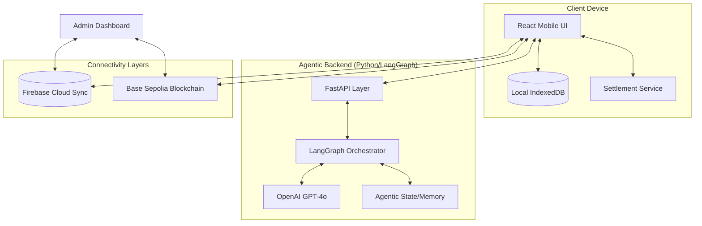

# Offline Stablecoin Wallet + AI Payment Agent (x402)

A state-of-the-art, mobile-first web application that merges **Offline-First Resilience** with **Agentic Finance**. This system enables seamless stablecoin transactions in zero-connectivity environments and leverages autonomous AI agents for complex, internet-native payments using the x402 protocol.

---

## 🗺 System Map

---

## 🧠 Design Decisions & Rationale

### 1. Offline-First "Local-Only" Mode
*   **Decision**: Prioritize `IndexedDB` over cloud authentication.
*   **Rationale**: Traditional wallets fail without internet. By encrypting keys locally and validating hashes against local storage, users can generate payment vouchers in "Airplane Mode." Firebase is used only as an *eventual consistency* layer for synchronization.

### 2. LangGraph for Agentic Orchestration
*   **Decision**: Use LangGraph instead of a simple linear chain.
*   **Rationale**: Payments are non-linear. They require state branching (e.g., "If high price, negotiate; else, approve") and asynchronous "Human-in-the-loop" checkpoints. LangGraph handles the complex state transitions and persistent session memory natively.

### 3. Protocol Alignment (x402)
*   **Decision**: Adopt the Coinbase x402 standard over custom APIs.
*   **Rationale**: To build for a machine-to-machine future, the wallet must speak the standard language of HTTP-native payments. This allows our agent to pay for any compliant resource (APIs, content, compute) without custom integrations.

### 4. Settlement Reciprocity
*   **Decision**: Settlement can be triggered by either the Sender or Receiver.
*   **Rationale**: In an offline exchange, one party might reach internet connectivity before the other. By allowing either device to "sweep" the temporary voucher wallet upon reconnecting, we drastically reduce the time-to-finality.

---

## 🤖 The Agentic Process (LangGraph)

Our `PaymentAgent` follows a sophisticated state-machine workflow to handle payments autonomously:

1.  **Discovery Phase (`check_url`)**: 
    The agent parses the target URL, inspecting HTTP headers and body for x402 requirements. It identifies the asset (USDC/EURC), amount, and network.
2.  **Negotiation Phase (`negotiate`)**: 
    If the server provides a negotiation endpoint or variable pricing, the AI analyzes the value proposition. It can propose counter-offers based on user-defined limits or historical data.
3.  **Human Verification (`interrupt`)**: 
    The graph **pauses** execution. It creates a "Checkpoint" in the backend, awaiting a `user_approved` signal from the frontend.
4.  **Execution Phase (`execute`)**: 
    Upon approval, the agent prepares the cryptographic proof (EIP-3009/EIP-2612). It doesn't hold keys; instead, it provides the instruction set to the Secure Client for signing.
5.  **Reconciliation (`complete`)**: 
    The agent verifies the transaction hash on-chain and retries the original request with the payment proof to unlock the content.

---

## � Advanced Features

### Batch Payment Agent
Processes a sequence of payments as a single unit of work. 
*   **Logic**: Aggregates totals across tokens -> Requests 1-time approval -> Executes in sequence -> Provides audit log of successes/failures.

### Scheduled & Recurring Agent
A background worker that manages time-based value transfers.
*   **Cron-for-Crypto**: Uses a task scheduler to wake the agent when payments are due.
*   **Autonomous Checks**: The agent verifies balance availability before attempting execution to avoid wasted gas.

---

## 🛡 Security & Auditability

*   **Encryption**: AES-GCM encryption for all local storage.
*   **Receiver Locking**: Vouchers are cryptographically bound to the recipient's public key.
*   **Admin Traceability**: Every administrative action (Force Settle, Mark Failed) is logged into an immutable Audit Log in Firestore for compliance.
*   **Sandboxed Agents**: The AI agent proposes actions but never has direct access to private keys; all signatures occur in the client-side secure context.

---

## 🚀 Getting Started

*Review the [Setup](#setup) section in the previous README for installation steps.*

**Developer Tip**: Use the `System Health` tab in the Admin Dashboard to monitor RPC latency and ensure your AI agent is connecting to the Base Sepolia network correctly.
